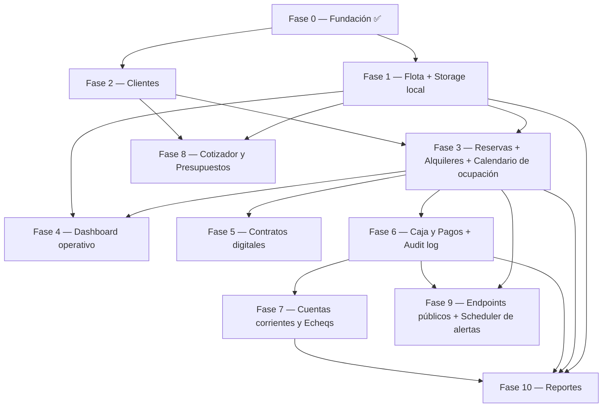

# Roadmap de Implementación — Ubicar Rent

> Plan por fases. Cada fase entrega valor end-to-end (backend + frontend integrados, desplegables, testeables).

## Visión

11 módulos del sistema agrupados en 9 fases. Cada fase tiene:

- **Objetivo** claro y medible.
- **Alcance** backend y frontend.
- **Dependencias** sobre fases anteriores.
- **Criterio de salida** verificable.
- **Notas de despliegue** (migraciones, env vars nuevas).

## Grafo de dependencias

Aristas dobles (F1+F2 a F3): F3 necesita ambos para arrancar.

## Tabla resumen

| Fase | Nombre | Módulos cubiertos | Depende de | Tiempo estimado |
|------|--------|-------------------|------------|------------------|
| 0 ✅ | Fundación | Bypass auth, migración inicial, seed admin, /health, Docker | — | hecho |
| 1 | Flota + Storage local | Vehículos (alta/edit/baja lógica/reactivar/historial), tarifas, documentos, fotos, gastos | F0 | 4-5 días |
| 2 | Clientes | Clientes + conductores adicionales | F0 | 3 días |
| 3 | Reservas + Alquileres + Calendario | Reservas, Alquileres, Checkout, Checkin, Control 24hs, endpoint `/ocupacion`, timeline | F1, F2 | 8-10 días |
| 4 | Dashboard operativo | Calendario protagonista + métricas + listas compactas (alquileres activos, devoluciones hoy) | F1, F3 | 2-3 días |
| 5 | Contratos digitales | Contratos, PDF, pre-llenado | F3 | 4-5 días |
| 6 | Caja y Pagos + Audit log | Pagos, Gastos, Audit log | F3 | 4 días |
| 7 | Cuentas corrientes y Echeqs | Cuentas corrientes, Movimientos, Echeqs | F6 | 3-4 días |
| 8 | Cotizador y Presupuestos | Cotizador, Presupuestos, conversión a Reserva | F1, F2 | 3 días |
| 9 | Endpoints públicos + Scheduler | `/public/disponibilidad`, `/public/reservas`, alertas APScheduler | F3 | 3 días |
| 10 | Reportes | Reportes con Recharts y export | F1, F3, F6, F7 | 4 días |

Total: ~40-50 días de desarrollo a tiempo parcial. Cada fase puede liberarse por separado.

**Reorden vs versión anterior:** el calendario de ocupación se construye dentro de F3 (no como F4 separada) porque el Dashboard es la pantalla operativa principal. Dashboard adelantado a F4 (antes era F9). Endpoints públicos y scheduler de alertas conviven en F9 (antes eran F4 y F9 por separado).

## Reglas para cada fase

### Antes de empezar

- Leer `PLANNING_BACKEND.md`, `PLANNING_FRONTEND.md` y el archivo de la fase (`docs/modules/XX_*.md`).
- Verificar que las fases dependencia estén con su criterio de salida cumplido.
- Crear un branch: `feat/fase-N-<nombre>`.

### Durante el desarrollo

- Backend primero hasta el endpoint funcional, luego frontend conectado.
- Migración nueva por cada cambio de schema.
- Tests por capa según `PLANNING_BACKEND.md` sección 12.
- Si aparece una decisión no documentada → editar el planning correspondiente, no inventar.

### Para cerrar la fase

- Checklist del Criterio de salida 100% verde.
- Migraciones aplicadas en dev.
- Smoke test manual del flujo principal.
- README/CHANGELOG actualizados si hay env vars nuevas.

## Detalle de fases

### Fase 0 — Fundación ✅

Ver `modules/00_fase0_fundacion.md` (documento original; la fase se cerró adaptada — Clerk se difirió, bypass de auth en dev).

Cerrada con:

- Migración inicial Alembic aplicada (15 tablas).
- Bypass `DEV_BYPASS_AUTH=true` en `core/deps.py` — upsertea admin local en DB y lo devuelve sin validar token.
- Seed idempotente en `backend/scripts/seed.py`.
- `/health` con check de DB OK.
- Stack dockerizado: postgres + backend. Frontend nativo.
- `app/auth.py` legacy (Auth0) borrado.

Pendientes pospuestos a fase Clerk:

- Integración real con Clerk (frontend `<ClerkProvider>` + backend JWKS validation).
- Reemplazo del bypass por `verify_token`.

### Fase 1 — Flota + Storage

Ver `modules/02_modulo_flota.md`.

- CRUD de Vehículos (con foto).
- CRUD de Tarifas por vehículo.
- CRUD de Documentos del vehículo (póliza, VTV).
- CRUD de Gastos del vehículo (servicios, combustible, etc).
- Adapter de storage (R2 + local).
- Página `/flota` con listado, alta, edición, detalle con tabs (datos / tarifas / documentos / gastos).

Por qué primero: todos los módulos posteriores referencian Vehículo. Sin flota no hay sistema.

### Fase 2 — Clientes

Ver `modules/06_modulo_clientes.md`.

- CRUD de Clientes con búsqueda por DNI/nombre.
- Conductores adicionales.
- Validación de licencia (vencimiento + advertencias).
- Página `/clientes` con listado, alta, edición, ficha.

Paralelizable con Fase 1 (no hay dependencias entre Flota y Clientes).

### Fase 3 — Reservas + Alquileres + Calendario de ocupación

Ver `modules/04_modulo_reservas_alquileres.md`.

- Reservas con detección de solapamientos.
- Alquileres con checkout, checkin.
- Control 24hs (gracia 40 min, cargo proporcional).
- Bonificación de excedente con audit.
- Estado en transición.
- Adapter de notificaciones (link wa.me).
- Páginas `/reservas`, `/alquileres/:id/checkout`, `/alquileres/:id/checkin`.
- **Calendario de ocupación** (movido desde F4):
  - `GET /api/v1/ocupacion?fecha_inicio&fecha_fin&vehiculo_ids` retorna reservas + alquileres por vehículo en formato timeline.
  - Reuso de `domain/solapamientos.py`.

Es el corazón del sistema. La fase más compleja.

### Fase 4 — Dashboard operativo

> Adelantado desde F9. Es la pantalla de bienvenida de la app — primera cosa que ven Franco y Martín al entrar.

- Layout: saludo + fecha → **calendario protagonista** (timeline de ocupación) → métricas (disponibles, alquilados, reservas hoy) → listas compactas (alquileres activos, devoluciones hoy).
- Componente `<OcupacionTimeline>` reutilizable (en página dedicada `/ocupacion` y embebido en dashboard).
- Endpoint `GET /api/v1/dashboard/stats` con métricas calculadas en backend.
- Reemplaza el dashboard con mocks del setup inicial.

Por qué adelantado: el sistema reemplaza a un Excel. La pantalla principal tiene que mostrar el estado operativo del día, no métricas históricas.

### Fase 5 — Contratos digitales

- Generación de PDF con reportlab.
- Almacenamiento en storage.
- Link de pre-llenado con token de un solo uso.
- Validación de contrato firmado en checkout (ahora bloquea).
- Página `/contratos` con vista previa.

### Fase 6 — Caja y Pagos + Audit log

- Pagos con todos los métodos.
- Gastos por categoría.
- Audit log append-only en tabla `audit_log`.
- Página `/caja` con vista diaria.

### Fase 7 — Cuentas corrientes y Echeqs

- Cuentas corrientes por cliente, saldo recalculado por triggers/lógica.
- Movimientos de cuenta corriente automáticos cuando pago = `cuenta_corriente`.
- Echeqs con máquina de estados.
- Páginas `/cuentas-corrientes`, `/echeqs`.

### Fase 8 — Cotizador y Presupuestos

- Endpoint de cotización con selección automática de tarifa.
- Presupuestos persistidos, PDF generado.
- Conversión Presupuesto → Reserva.
- Página `/cotizador`.

### Fase 9 — Endpoints públicos + Scheduler de alertas

> Dashboard funcional se adelantó a F4. Acá quedan los pendientes públicos y las alertas automáticas.

- Endpoint público `GET /api/v1/public/disponibilidad` sin auth, con rate limiting (slowapi).
- Endpoint público `POST /api/v1/public/reservas` que crea Cliente/Reserva pendiente.
- CORS extra para `LANDING_URL`.
- APScheduler en `jobs/alertas.py` con job diario a las 08:00 (zona Argentina).
- Tabla `alertas` (migración) + `GET /api/v1/alertas` + `POST /alertas/{id}/marcar-vista`.
- Bell de alertas en el header con badge de no vistas.

### Fase 10 — Reportes

- Reportes de ocupación, ingresos, vehículos.
- Página `/reportes` con Recharts.
- Export CSV y PDF.

## Cuándo cerrar el roadmap

Se considera "MVP completo" después de Fase 4 (sistema operativo con calendario, ya reemplaza el Excel). Las Fases 5-10 agregan capacidades específicas pero no bloquean operación diaria.

Después del MVP, ciclos de iteración basados en feedback real de Franco y Martín.
